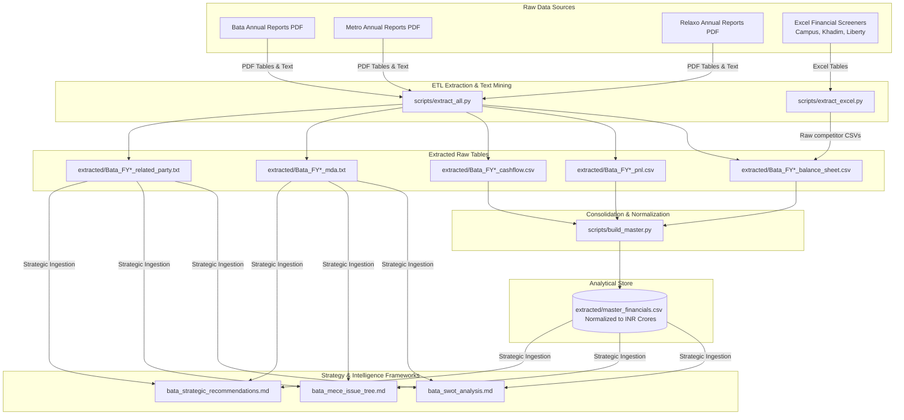

# Footwear Sector Intelligence: Bata India & Competitor Analysis Pipeline

An end-to-end data engineering and strategic analysis pipeline designed to extract, clean, and consolidate financial and qualitative disclosures from **Bata India** and its major industry competitors (**Metro Brands, Relaxo, Campus Activewear, Khadim India, and Liberty Shoes**) from **FY21 to FY25**. 

*Read the core business findings and diagnostic highlights in our [Executive Summary](bata_executive_summary.md).*

The project automates the transition from unstructured PDFs (Annual Reports) and Excel exports to a clean, unified analytical database, followed by structured corporate strategy frameworks (MECE issue trees, SWOT, and strategic recommendations).

---

## 📊 Pipeline Architecture & Data Flow

Below is the flowchart representing the automated ETL pipeline and the generation of strategic deliverables:



---

## 🚀 Key Features

- **Automated Financial Extraction:** High-precision parsing of Balance Sheets (BS), Profit & Loss statements (P&L), and Cash Flow statements (CF) from multi-hundred-page PDFs using coordinate-based layout filtering.
- **Qualitative Text Mining:** Extracts critical narrative sections, including:
  - Management Discussion & Analysis (MD&A)
  - Related Party Transactions (RP)
  - Contingent Liabilities (CL)
  - Independent Auditor Reports
- **Unit Normalization & Data Cleansing:** Standardizes financial figures across varying original units (INR Lakhs, INR Millions, INR Crores) into a unified **INR Crore** master dataset (`master_financials.csv`). Resolves layout-shifting and merged columns dynamically.
- **Strategic Analysis Outputs:** Translates raw numbers and qualitative texts into publication-ready strategy documents, including MECE issue trees, detailed SWOT matrices, and actionable business recommendations.

---

## 📁 Repository Structure

```directory
├── extracted/                      # Output directory for clean CSVs & TXT files
│   ├── master_financials.csv       # Consolidated data across all companies and years (INR Crores)
│   ├── Bata_FY2X_balance_sheet.csv
│   └── ...                         # Statements and qualitative text segments
├── scripts/                        # Core Python ETL and processing scripts
│   ├── extract_all.py              # Main PDF coordinates-based extraction engine
│   ├── build_master.py             # Normalization, unit conversion, and consolidation script
│   ├── extract_excel.py            # competitor metrics extractor for Excel screener sheets
│   └── generate_analysis_files.py  # Generates markdown strategic analysis deliverables
├── bata_swot_analysis.md           # Strategic SWOT analysis framework
├── bata_mece_issue_tree.md         # MECE Issue Tree detailing root causes of margin decline
├── bata_strategic_recommendations.md # Executable retail & omni-channel recommendations
├── bata_executive_summary.md       # High-level business overview and strategic key findings
├── TECHNICAL_DOCUMENTATION.md      # Comprehensive technical architecture & workflows
├── requirements.txt                # Python dependencies
└── README.md                       # Repository overview (this file)
```

---

## 🛠️ Data Pipeline & Workflow

For a detailed explanation of the libraries used (PyMuPDF, Pandas, OpenPyXL), operational metrics, formulas, and pipeline configuration, check out the [Technical System Documentation](TECHNICAL_DOCUMENTATION.md).

### 1. Extraction (`scripts/extract_all.py`)
- Employs `PyMuPDF` (`fitz`) to execute coordinate-based bounding box queries to isolate tabular data from PDFs.
- Utilizes explicit page maps to locate consolidated vs. standalone statements across 15+ annual reports.
- Handles horizontal/vertical splits for side-by-side tables (such as Metro's landscape layouts).

### 2. Standardization & Consolidation (`scripts/build_master.py`)
- Standardizes diverse currencies and scales into **INR Crores**.
- Automatically corrects common PDF extraction bugs (e.g., merged values in "Note" or "Previous Year" columns).
- Annotates each record with metadata (`data_status`, `statement_type`, `unit_original`).

### 3. Competitor Integration (`scripts/extract_excel.py`)
- Ingests screener spreadsheets for pure-play athletic and value footwear players (Campus, Khadim, Liberty).
- Appends historical financial coordinates to the master table.

---

## 📈 Strategic Deliverables & Visualizations

### 1. MECE Issue Tree & Strategic Frameworks
The core strategic challenges (Bata's stagnant EBITDA and volume loss) are broken down into mutually exclusive and collectively exhaustive root causes:
* **[MECE Issue Tree Detail](bata_mece_issue_tree.md):** Analyzes asset-heavy overheads, delayed "Sneakerization" response, and supply-chain drag.
* **[SWOT Analysis Detail](bata_swot_analysis.md):** Details Bata’s strong distribution network and high cash reserves versus legacy premium pricing challenges and inventory holding days.


*Figure 1: MECE Issue Tree Structure for Footwear Sector Profitability Analysis*

---

### 2. Peer Benchmarking & Financial Analysis
Our pipeline produces deep financial comparisons across the sector:

#### EBITDA Margin Peer Comparison
Metro Brands enjoys industry-leading premium margins, while Relaxo maintains mass-market volume efficiency.


#### Altman Z-Score Credit Risk Analysis
Visualizes the credit health and default risk boundaries across peers to monitor financial distress risk.


---

### 3. Actionable Business Recommendations
Detailed recommendations are prioritized using an impact-feasibility matrix:
- **[Strategic Recommendations Detail](bata_strategic_recommendations.md):** Actionable plans for T3-T5 franchise expansion, Sneaker Studio scaling, and "Endless Aisle" omni-channel deployment.


*Figure 2: Prioritizing Strategic Initiatives by Implementation Feasibility and Enterprise Impact*

---

## ⚙️ Getting Started

### Prerequisites
- Python 3.9+
- `pip` package manager

### Installation
1. Clone the repository:
   ```bash
   git clone https://github.com/your-username/bata-competitor-intelligence.git
   cd bata-competitor-intelligence
   ```
2. Install dependencies:
   ```bash
   pip install -r requirements.txt
   ```

### Execution
Run the entire pipeline from raw data to consolidated master sheet:
```bash
# 1. Run the extraction from raw PDFs
python scripts/extract_all.py

# 2. Consolidate and build master dataset
python scripts/build_master.py
```
