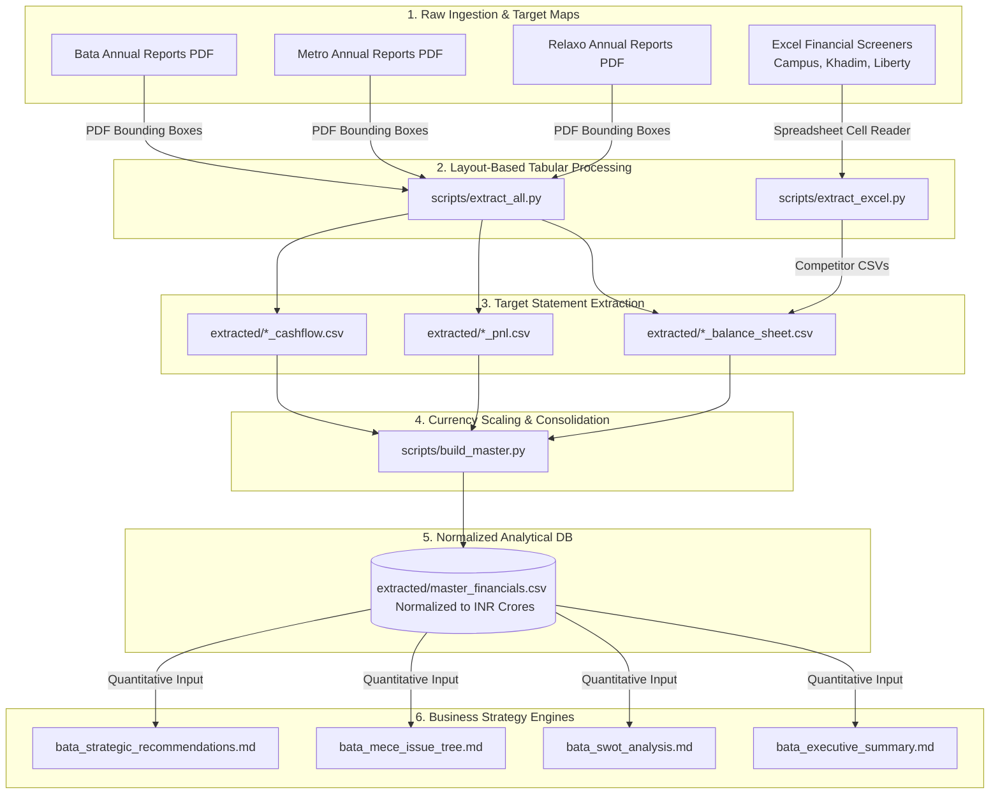
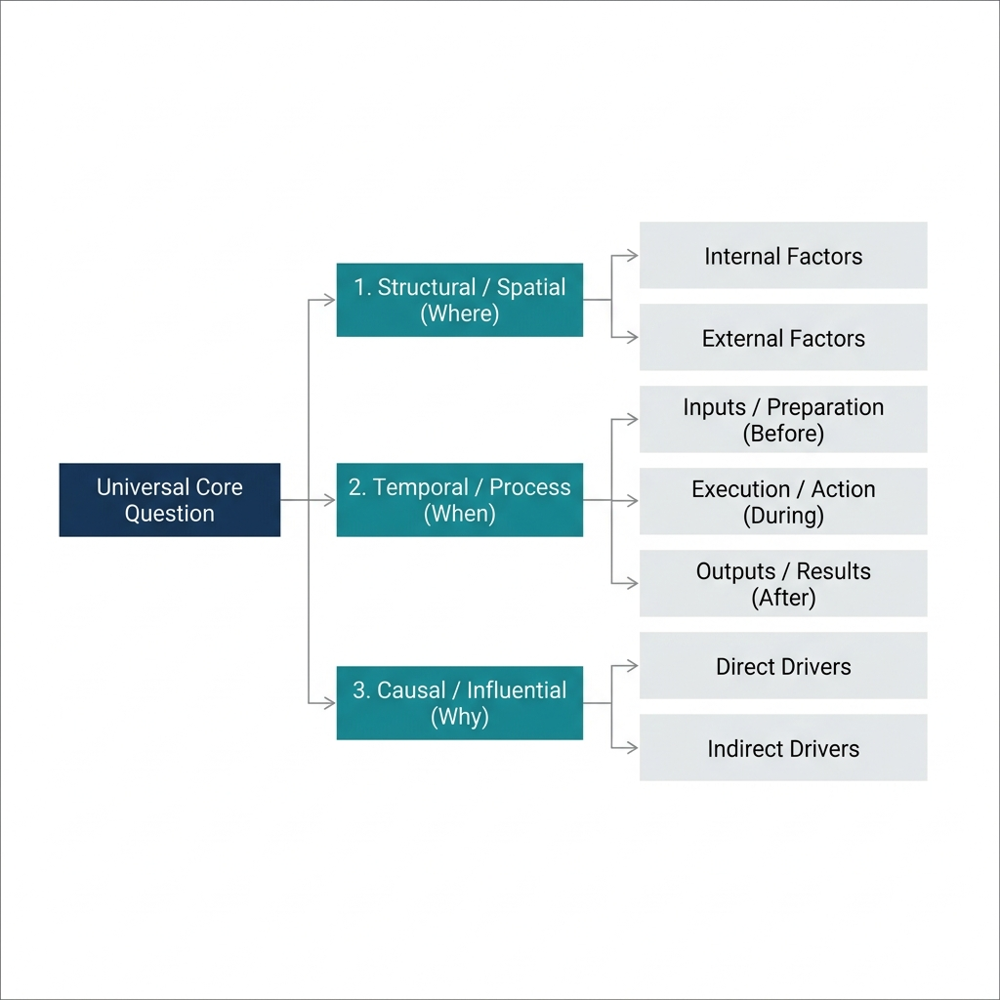
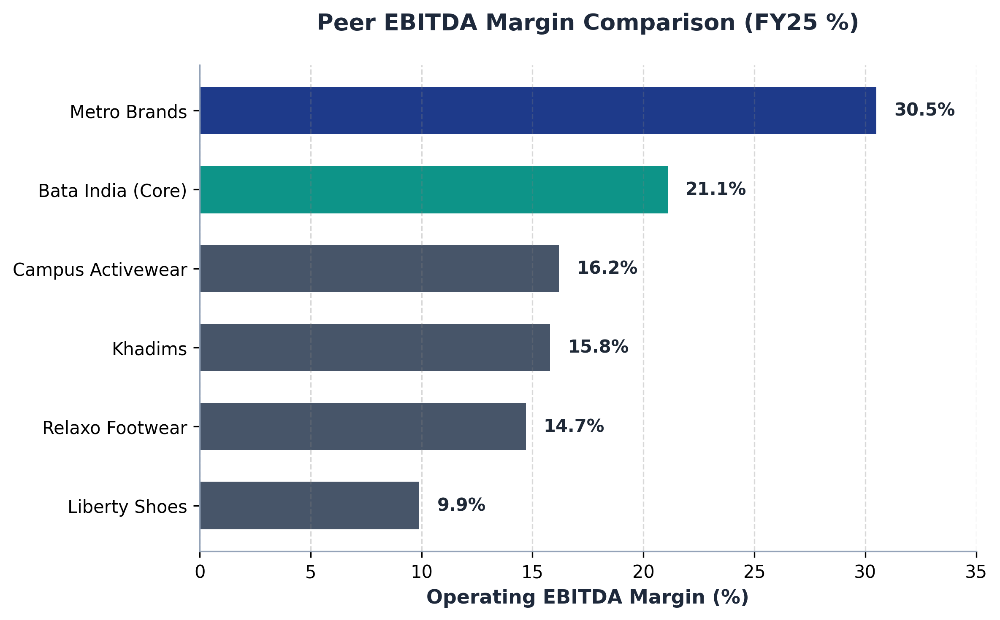
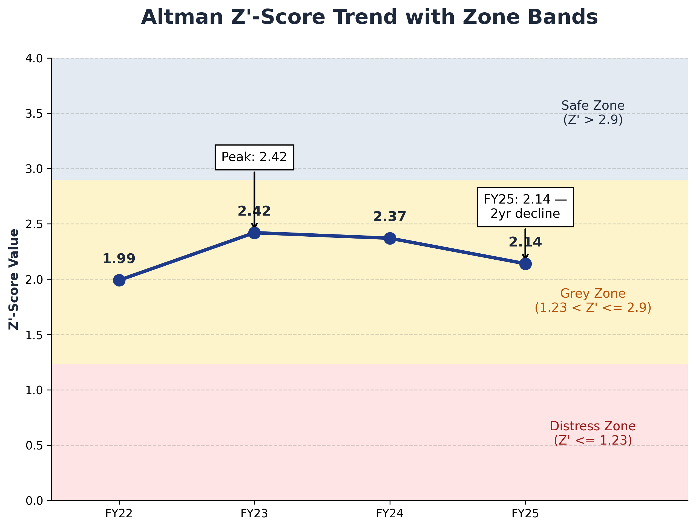
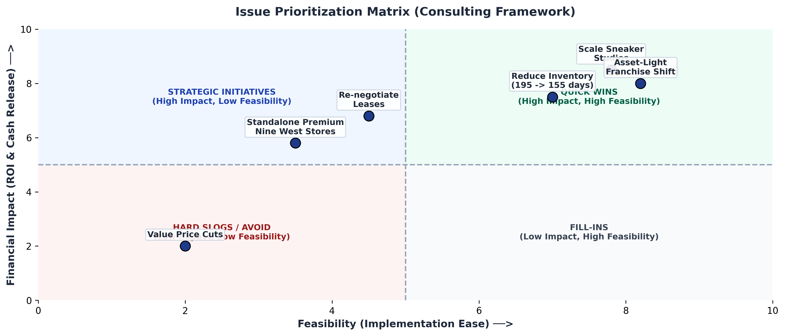

# Footwear Sector Intelligence: Financial Extraction, Normalization & Competitive Analysis

An end-to-end financial data engineering and corporate strategy pipeline designed to programmatically extract, clean, and consolidate financial and qualitative disclosures from **Bata India Limited** and its listed peers (**Metro Brands, Relaxo Footwears, Campus Activewear, Liberty Shoes, and Khadim India**) across **FY21 to FY25**.

The project automates the transition from unstructured PDF annual reports and Excel sheets to a unified, normalized database (`master_financials.csv`), culminating in structured, quantitative strategic reports.

*Read the core business findings and diagnostic highlights in our [Executive Summary](bata_executive_summary.md).*

---

## 📌 Table of Contents
1. [Core Features & Capabilities](#-core-features--capabilities)
2. [Data Pipeline Architecture](#-data-pipeline-architecture)
3. [FinTech Specifications & Methodologies](#-fintech-specifications--methodologies)
4. [Structured File Tree & Order](#-structured-file-tree--order)
5. [Deliverables & Visualizations](#-deliverables--visualizations)
6. [Getting Started & Local Setup](#-getting-started--local-setup)

---

## 🚀 Core Features & Capabilities

- **High-Precision Layout Mining:** Utilizes coordinate-based bounding box filtering to isolate columns of data from multi-hundred-page annual reports where gridlines are missing or formats vary.
- **Multicurrency & Unit Normalization:** Standardizes financials reported in different scales (INR Lakhs, INR Millions, INR Crores) into a unified unit (**INR Crore**) by applying dynamic multiplier mapping.
- **Automated Text Summarization:** Programs text extraction from specific sections (Management Discussion & Analysis, Related Party Transactions, Contingent Liabilities, and Auditor Reports) to identify qualitative risks.
- **Solvency & Credit Modeling:** Programmatically computes Altman Z-Score credit default risk trends and financial ratio benchmarks.
- **Visual Intelligence Output:** Automatically plots EBITDA margins, solvency vectors, and impact-feasibility matrices, exporting them directly to the repository homepage.

---

## 📊 Data Pipeline Architecture

The flowchart below represents the ETL data flow from raw unstructured input files to the normalized database and strategic reports:



---

## ⚙️ FinTech Specifications & Methodologies

### 1. Dynamic Coordinate Filtering
Standard text-extraction tools merge columns together on pages without gridlines. This pipeline uses `PyMuPDF` (`fitz`) to extract words with precise decimal bounding boxes `(x0, y0, x1, y1)`. Horizontal column delimiters ($x$-min and $x$-max boundaries) are custom-tuned per company and year to isolate target columns:
- **Vertical splitting:** Handles Metro's landscape layouts by splitting the page width down the middle ($x = 572$) and processing the left and right sides independently as Balance Sheets and P&Ls.
- **Merged value resolution:** Regular expressions isolate and separate numbers that have run together during PDF parsing.

### 2. Multi-Scale Currency Standardization
Financial filings use different units. The pipeline scales all numbers into **INR Crores** using the following rules:
$$\text{Scaled Value} = \text{Raw Value} \times \text{Conversion Factor}$$
- **Bata India Limited:** Filed in *INR Millions* (Conversion Factor = $0.1$)
- **Metro Brands Limited:** Filed in *INR Lakhs* for FY21-FY23 (Conversion Factor = $0.01$) and *INR Crores* for FY24-FY25 (Conversion Factor = $1.0$)
- **Relaxo Footwear & Competitors:** Filed in *INR Crores* (Conversion Factor = $1.0$)

### 3. Quantitative Financial Analysis
- **Altman Z-Score Default Analysis:** Computed using emerging market weights:
  $$\text{Z-Score} = 6.56(X_1) + 3.26(X_2) + 6.72(X_3) + 1.05(X_4)$$
  - $X_1 = \text{Working Capital} / \text{Total Assets}$
  - $X_2 = \text{Retained Earnings} / \text{Total Assets}$
  - $X_3 = \text{EBIT} / \text{Total Assets}$
  - $X_4 = \text{Book Value of Equity} / \text{Total Liabilities}$
- **Operating EBITDA Margin:** Standardized across peers by stripping out non-operating items (such as Bata's FY25 ₹133.95 Cr land monetization gain) to isolate true operating efficiency.

---

## 📁 Structured File Tree & Order

Files are organized in logical order, placing documentation and final analysis deliverables at the top, followed by source scripts, database files, and raw data files:

```directory
├── README.md                       # Primary repository overview (this file)
├── TECHNICAL_DOCUMENTATION.md      # Comprehensive technical architecture & stack justification
├── bata_executive_summary.md       # High-level business overview and strategic key findings
├── bata_swot_analysis.md           # Strategic SWOT analysis framework
├── bata_mece_issue_tree.md         # MECE Issue Tree detailing root causes of margin decline
├── bata_strategic_recommendations.md # Actionable retail & omni-channel recommendations
│
├── scripts/                        # Core Python ETL and processing scripts
│   ├── extract_all.py              # Main PDF coordinates-based extraction engine
│   ├── build_master.py             # Normalization, unit conversion, and consolidation script
│   ├── extract_excel.py            # competitor metrics extractor for Excel screener sheets
│   └── generate_analysis_files.py  # Generates markdown strategic analysis deliverables
│
├── extracted/                      # Output directory for clean CSVs & charts
│   ├── master_financials.csv       # Consolidated data across all companies and years (INR Crores)
│   ├── ratio_analysis.csv          # Core financial ratios computed across peers
│   ├── peer_benchmark.csv          # Peer financial comparison metrics
│   ├── peer_ebitda_margin_chart.png# EBITDA Margin comparison chart
│   ├── Z_Score_Chart.png           # Altman Z-Score credit risk chart
│   └── impact_feasibility_matrix.png # Strategic recommendations prioritization plot
│
├── requirements.txt                # Python dependencies
│
├── Bata Overview.pdf               # Primary raw data file: Bata overview presentation
├── Bata_FY25.pdf                   # Raw annual report files for Bata India
├── Bata_FY24.pdf
├── Bata_FY23.pdf
├── Bata_FY22.pdf
├── Bata_FY21.pdf
├── Metro_FY25.pdf                  # Raw annual report files for Metro Brands
├── Metro_FY24.pdf
├── Metro_FY23.pdf
├── Metro_FY22.pdf
├── Metro_FY21.pdf
├── Relaxo_FY25.pdf                 # Raw annual report files for Relaxo Footwear
├── Relaxo_FY24.pdf
├── Relaxo_FY23.pdf
├── Relaxo_FY22.pdf
├── Relaxo_FY21.pdf
├── Campus Activewe.xlsx            # Competitor Excel spreadsheets
├── Khadim India.xlsx
└── Liberty Shoes.xlsx
```

---

## 📈 Deliverables & Visualizations

### 1. Strategic Diagnostic (MECE Issue Tree)
Examines stagnating capex efficiency and isolates structural bottlenecks in profitability.


### 2. Peer EBITDA Margin Comparison
Compares core operating margins, highlighting the margin deficit relative to premium peers.


### 3. Credit Default Risk (Altman Z-Score)
Tracks solvency indexes over time relative to standard safe and default zones.


### 4. Implementation Prioritization Matrix
Prioritizes strategic recommendations based on financial impact vs implementation feasibility.


---

## ⚙️ Getting Started & Local Setup

### Prerequisites
- Python 3.9+
- `pip` package manager

### Installation
1. Clone the repository:
   ```bash
   git clone https://github.com/Madzzzz1106/Bata-Finance-Modelling-Overview-.git
   cd Bata-Finance-Modelling-Overview-
   ```
2. Install dependencies:
   ```bash
   pip install -r requirements.txt
   ```

### Execution
Run the entire extraction and data normalization pipeline:
```bash
# 1. Run the extraction from raw PDFs
python scripts/extract_all.py

# 2. Consolidate and build master dataset
python scripts/build_master.py
```
For deep-dive methodology details, please refer to the [Technical System Documentation](TECHNICAL_DOCUMENTATION.md).
