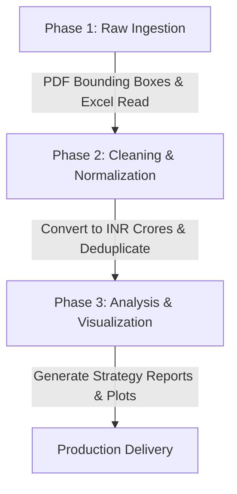

# Footwear Sector Intelligence: Technical Documentation & System Architecture

This document details the complete technical architecture, engineering workflows, library justifications, and methodology used to build the Footwear Sector Intelligence pipeline comparing **Bata India** with its peer competitors.

---

## 🛠️ Technology Stack & Library Justifications

The system is built entirely in **Python**, leveraging key data science and document extraction libraries to process unstructured report structures.

| Library / Tool | Primary Role in System | Technical Justification |
| :--- | :--- | :--- |
| **`PyMuPDF` (`fitz`)** | Raw PDF Layout Parsing & Text Mining | Chosen over PyPDF2/pdfplumber because of its superior speed and layout precision. PyMuPDF allows word extraction with precise decimal coordinates `(x0, y0, x1, y1)`. This is essential because annual report layouts vary yearly, requiring custom-tuned bounding boxes to isolate columns without bleed-through. |
| **`Pandas` (`pandas`)** | Tabular Data Transformation & Aggregation | Acts as the core data engine. Normalizes data across columns, cleans parsed fields, handles merged values, converts and scales currencies (Lakhs/Millions ➔ Crores), deduplicates records, and exports clean CSV outputs. |
| **`OpenPyXL` / `xlrd`** | Competitor Screener Spreadsheet Ingestion | Enables programmatic read access to formatted Excel documents (`.xlsx`) containing pre-processed financials for Campus, Khadim, and Liberty. |
| **`Matplotlib` / `Seaborn`** | Data Visualization Generation | Generates high-fidelity comparative charts (EBITDA margin trends, Altman Z-Score credit risk rankings, and strategic prioritization plots) stored as transparent PNG outputs. |

---

## ⚙️ System Workflow & Pipeline Architecture

The pipeline processes files through three sequential phases:

### Phase 1: High-Precision PDF & Excel Extraction
1. **Dynamic Tabular Extraction:** The extraction script `scripts/extract_all.py` maps specific pages containing Balance Sheets, P&Ls, and Cash Flows for each company/year.
2. **Coordinate Bounding Boxes:** To handle vertical columns without gridlines, the script filters characters by horizontal limits ($x$-min and $x$-max thresholds) matching the specific table columns.
3. **Split Column Handling:** For side-by-side portrait pages (such as Metro's landscape layouts), the engine dynamically splits the page width down the middle ($x = 572$) and treats the left and right halves as separate tables.
4. **Competitor Excel Extraction:** `scripts/extract_excel.py` parses multi-sheet Excel workbooks for competitors (Campus, Khadim, Liberty), mapping and flattening historical columns.

### Phase 2: Consolidation & Unit Normalization
* **Currency Conversion:** Original company reports are filed in varying units:
  * **Bata India:** INR Millions
  * **Metro Brands:** INR Lakhs (FY21-23) / INR Crores (FY24-25)
  * **Relaxo / Competitor Excels:** INR Crores
* **Dynamic Resolution:** `scripts/build_master.py` detects the reporting scale and applies multiplicative factors (`0.1` for Millions, `0.01` for Lakhs) to scale all metrics consistently into **INR Crores**.
* **Cleansing Regex:** Handles parenthetical negative numbers (e.g. `(142.5)` ➔ `-142.5`), hyphens/em-dashes (➔ `0`), and splits numbers mistakenly merged into a single text block by the parser.
* **Deduplication:** Merges records on the key `[Company, FinancialYear, Statement, Metric, statement_type]`, preserving the first reporting instance and creating `master_financials.csv`.

### Phase 3: Analytical Engine & Strategic Frameworks
The pipeline triggers strategic generators to format outputs:
1. **Financial Ratio Computations:** Computes margins, asset turnover, working capital ratios, and credit health markers (Altman Z-Score).
2. **Strategy Document Builder:** `scripts/generate_analysis_files.py` compiles findings into structured Markdown reports:
   - `bata_swot_analysis.md`
   - `bata_mece_issue_tree.md`
   - `bata_strategic_recommendations.md`

---

## 📈 Strategic Calculations Reference

### 1. Altman Z-Score (Credit Risk Analysis)
To calculate credit default probability, the system uses the standard formula for emerging markets:
$$\text{Z-Score} = 6.56(X_1) + 3.26(X_2) + 6.72(X_3) + 1.05(X_4)$$
* $X_1 = \text{Working Capital} / \text{Total Assets}$
* $X_2 = \text{Retained Earnings} / \text{Total Assets}$
* $X_3 = \text{EBIT} / \text{Total Assets}$
* $X_4 = \text{Book Value of Equity} / \text{Total Liabilities}$

*Interpretation: Z-Score > 2.9 (Safe Zone), 1.23 to 2.9 (Grey Zone), < 1.23 (Distress Zone).*

### 2. Operational Metrics
- **EBITDA Margin:** $\text{EBITDA} / \text{Revenue from Operations}$
- **Inventory Turn Days:** $(\text{Average Inventory} / \text{Cost of Goods Sold}) \times 365$
- **Receivables Turnover Days:** $(\text{Average Receivables} / \text{Revenue from Operations}) \times 365$
